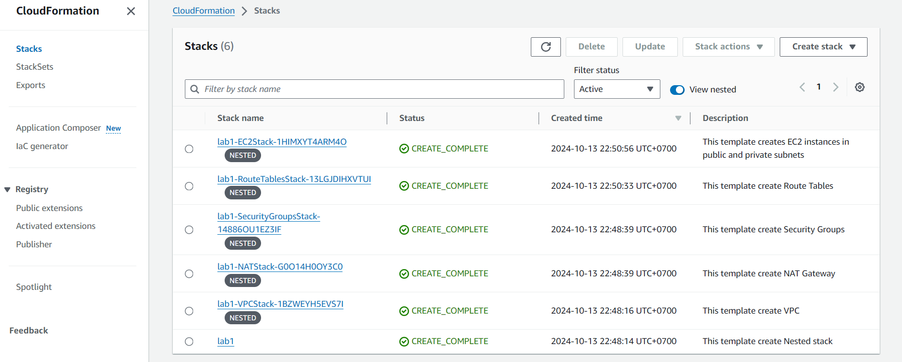
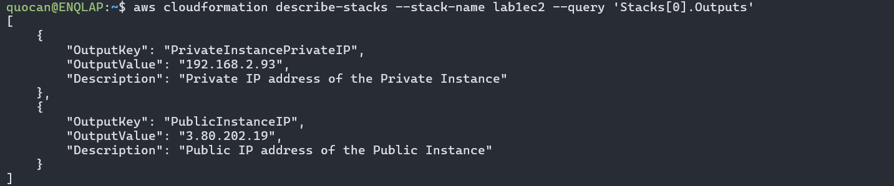
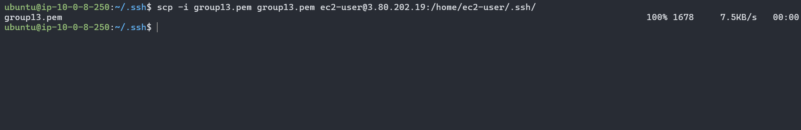
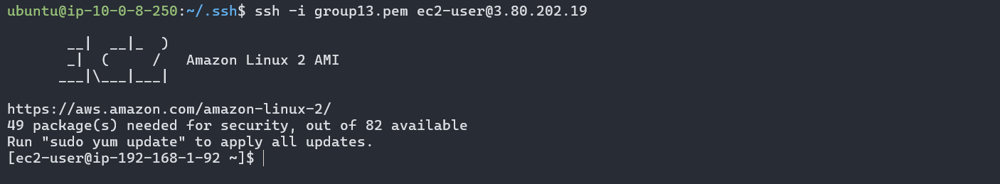
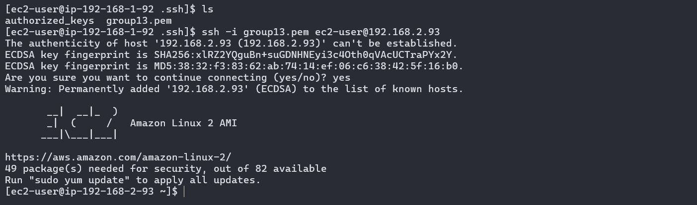

# Lab 1 CloudFormation Guide

## Prerequisites
- AWS Account
- AWS CLI installed and configured

## Steps to Run the Source

1. **Clone the Repository**
    ```sh
    git clone https://github.com/tramcandoit/NT548-Lab.git
    cd CloudFormation
    ```

2. **Upload templates to your S3 bucket**
    ```sh
    aws s3 cp templates/vpc-cfn.yaml s3://your-bucket/
    aws s3 cp templates/vpc-cfn.yaml s3://your-bucket/
    aws s3 cp templates/vpc-cfn.yaml s3://your-bucket/
    aws s3 cp templates/vpc-cfn.yaml s3://your-bucket/
    aws s3 cp templates/vpc-cfn.yaml s3://your-bucket/
    ```
    Or you can use AWS web interface on AWS Management Console

3. **Create a keypair**
   
   Go to EC2 Services then create a keypair

4. **Modify the main-cfn.yaml**
    ```yaml
      AllowedSSHIP:
        Description: The IP address allowed to SSH to the public EC2 instances
        Type: String
        Default: 0.0.0.0/0  # Change to your user IP address or keep it if you want the Public Instance be able to SSH from anywhere.

      KeyName:
        Description: Name of an existing EC2 KeyPair to enable SSH access to the instances
        Type: AWS::EC2::KeyPair::KeyName
        Default: group13  # Change to your keypair name
    ```
    ```yaml
    Type: AWS::CloudFormation::Stack
    Properties:
      TemplateURL: https://nt548-labs.s3.amazonaws.com/vpc-cfn.yaml  # Replace all TemplateURL with path/to/your/<stack>-cfn.yaml
      TimeoutInMinutes: 10
    ```

5. **Create Stacks**
    ```sh
    aws cloudformation create-stack --stack-name lab1 --template-body file://main-cfn.yaml
    ```
Now we should see all stacks created successfully



## Steps to SSH to Instances

1. **Inspect Public Instance IP and Private Instance PrivateIP**
    ```sh
    aws cloudformation describe-stacks --stack-name <your-ec2-stack-name> --query 'Stacks[0].Outputs'
    ```
    

2. **Secure copy Private Key to Public Instance**
    ```sh
    scp -i <your-private-key> <your-private-key> ec2-user@<your-public-instance-ip>:/home/ec2-user/.ssh/
    ```
    

    > **Note**: From this step, make sure you are working on a device which IP is allowed (specified in `AllowedSSHIP`)

3. **SSH to Public Instance**
    ```sh
    ssh -i <your-private-key> ec2-user@<your-public-instance-ip>
    ```
    

4. **SSH to Private Instance**
    ```sh
    cd .ssh
    ssh -i <your-private-key> ec2-user@<your-private-instance-privateip>
    ```
    